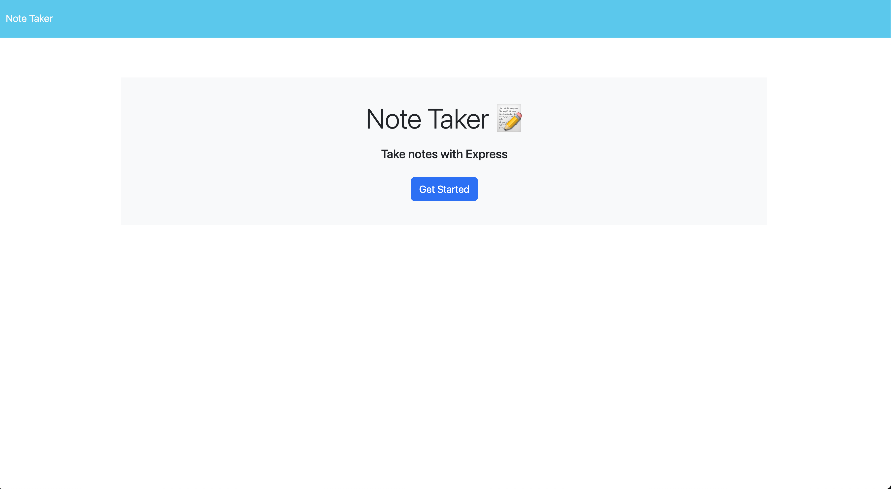

# Note-Taking Application

This is a note-taking application that allows users to create, save, and view notes. The application provides a user-friendly interface for managing personal notes efficiently.

## Images


## User Story

The application fulfills the following user story:

**As a user,**
- **I want to open the Note Taker and be presented with a landing page with a link to a notes page.**
- **I want to click on the link to the notes page and be presented with a page displaying existing notes on the left-hand column, and empty fields to enter a new note title and its text in the right-hand column.**
- **I want a Save icon to appear in the navigation at the top of the page when I enter a new note title and its text.**
- **I want to be able to click on the Save icon and save the new note, which will then appear in the left-hand column with the other existing notes.**
- **I want to click on an existing note in the left-hand column and have it displayed in the right-hand column.**
- **I want to click on the Write icon in the navigation at the top of the page and be presented with empty fields to enter a new note title and its text in the right-hand column.**

## Usage

To use the Note-Taking Application, follow these steps:

1. Clone the repository to your local machine.
2. Install the required dependencies.
``` cd Note-Taker
    npm install
```
3. Start the application.

4. Open your web browser and navigate to `http://localhost:3000` to access the Note Taker.

5. On the landing page, click on the link to the notes page.

6. On the notes page, enter a new note title and its text in the right-hand column.

7. Once you have entered the new note, a Save icon will appear in the navigation at the top of the page.

8. Click on the Save icon to save the new note. The note will now appear in the left-hand column with the other existing notes.

9. To view the contents of an existing note, click on the note in the left-hand column. It will be displayed in the right-hand column.

10. To create a new note, click on the Write icon in the navigation at the top of the page. Empty fields will be presented in the right-hand column to enter a new note title and its text.

## Technologies Used

The Note-Taking Application is built using the following technologies:

- HTML
- CSS
- JavaScript
- Node.js
- Express.js

## Acknowledgements

- The Note-Taking Application is based on the user story provided by [User Story XYZ](https://userstoryxyz.com).
- Special thanks to the developers and contributors of the libraries and frameworks used in this project.

## License

This project is licensed under the [MIT License](https://opensource.org/licenses/MIT).


